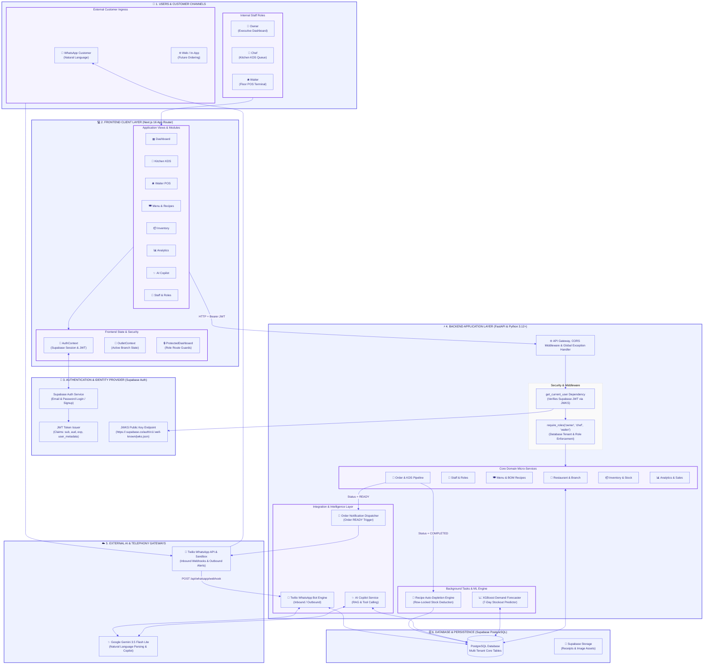
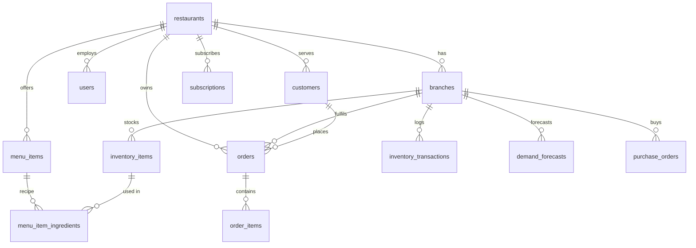
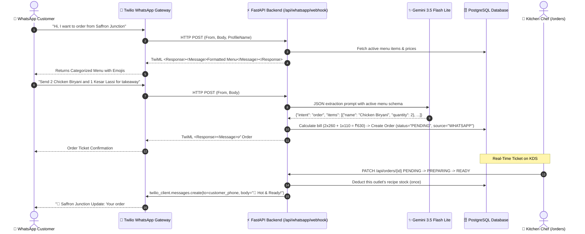

# 🍲 RasoiSaathi (रसोई साथी) — Complete Technical Architecture & System Documentation

> **Next-Generation Omnichannel Restaurant Operating System, AI Kitchen Copilot & WhatsApp Automated Ordering Engine**

## ⚡ Quick Start (Windows)

Double-click **`dev.cmd`** (or run `.\dev.cmd` in a terminal). It checks your setup, installs anything missing, applies database migrations, starts the API and the web app, and opens the browser. `.\dev.cmd -Check` only runs the checks — use it first whenever something doesn't work.

Needs: Python 3.12+, Node.js, `backend/.env` and `frontend-mockup/.env` (see section 12).

### 👀 Demo logins

The login page has **Try as Owner / Chef / Waiter** buttons that open a sample restaurant, "Saffron Junction", with live orders, low stock and four weeks of sales:

| Role | Email | Password |
|---|---|---|
| Owner | `owner@rasoisaathi-demo.app` | `SaffronDemo@2026` |
| Chef | `chef@rasoisaathi-demo.app` | `SaffronDemo@2026` |
| Waiter | `waiter@rasoisaathi-demo.app` | `SaffronDemo@2026` |

`dev.cmd` creates these logins the first time it runs. That requires Supabase → Authentication → Sign In / Providers → Email → **Confirm email** to be turned off. After that the API rebuilds the demo by itself every few hours (and each new day), so it always has live tickets and today's sales and visitors' changes don't pile up. To reset it right away, run `python seed_demo.py` in `backend/`. In the demo workspace, visitors can't change staff or outlets or send test WhatsApp messages, so it keeps working for the next person.

---

## 📑 Table of Contents
1. [System Overview & Vision](#1-system-overview--vision)
2. [System Architecture & Flow](#2-system-architecture--flow)
3. [Multi-Tenant Database Architecture & Schemas](#3-multi-tenant-database-architecture--schemas)
4. [Role-Based Access Control (RBAC) & Security Architecture](#4-role-based-access-control-rbac--security-architecture)
5. [AI WhatsApp Ordering Bot (Twilio + Gemini)](#5-ai-whatsapp-ordering-bot-twilio--gemini)
6. [Kitchen Display System (KDS) & Order Lifecycle](#6-kitchen-display-system-kds--order-lifecycle)
7. [Recipe (BOM) Stock Deduction](#7-recipe-bom-stock-deduction)
8. [Ingredient Forecasting & Reorder Alerts](#8-ingredient-forecasting--reorder-alerts)
9. [RasoiSaathi AI Copilot](#9-rasoisaathi-ai-copilot-gemini-function-calling--policy-retrieval)
10. [REST API Reference](#10-rest-api-reference)
11. [Frontend Structure](#11-frontend-structure)
12. [Installation, Seeding & Deployment Guide](#12-installation-seeding--deployment-guide)
13. [Troubleshooting Login](#13-troubleshooting-login)

---

## 1. System Overview & Vision

**RasoiSaathi (रसोई साथी)** is a cloud-native, multi-tenant restaurant operating platform engineered specifically for Indian food establishments — ranging from single-location diners to multi-outlet cloud kitchen networks. 

### Core Problems Solved:
1. **Aggregator Commission Drag & Friction**: Enables direct WhatsApp-based conversational food ordering with zero aggregator commissions.
2. **Kitchen-Floor Disconnect**: Unifies incoming orders across POS, WhatsApp, Swiggy, and Zomato into a synchronized Kitchen Display System (KDS).
3. **Food Waste & Stockouts**: Real-time recipe-based ingredient consumption tracking coupled with an XGBoost machine learning model that forecasts ingredient demands 7 days in advance.
4. **Actionable Business Intelligence**: An AI Copilot that allows restaurant owners to query their operational data via natural language.

---

## 2. System Architecture & Flow

### 🌟 High-Level Architecture Overview (Simplified)


---

### 🔍 Detailed Tier-by-Tier Component Breakdown



---

### 🔐 Detailed Authentication & Identity Architecture

RasoiSaathi uses a **decoupled hybrid authentication pattern** combining **Supabase Auth** (for client credentials and session tokens) and **FastAPI internal RBAC** (for multi-tenant data isolation and role boundaries):

```mermaid
sequenceDiagram
    autonumber
    actor User as 👤 Restaurant User (Owner / Chef / Waiter)
    participant Client as 💻 Next.js Frontend (AuthContext)
    participant SupaAuth as 🔐 Supabase Auth Server
    participant FastAPI as ⚡ FastAPI Backend (get_current_user)
    participant SupaJWKS as 🔑 Supabase JWKS Endpoint
    participant DB as 🗄️ PostgreSQL (users table)

    Note over User,SupaAuth: 1. User Sign-In Flow
    User->>Client: Enters Email & Password
    Client->>SupaAuth: supabase.auth.signInWithPassword({ email, password })
    SupaAuth-->>Client: Returns Auth Session { access_token (JWT), refresh_token, user: { id: "uuid" } }
    Client->>Client: Stores session in localStorage & AuthContext

    Note over Client,FastAPI: 2. Authenticated API Call
    Client->>FastAPI: GET /api/auth/me (Header: Authorization: Bearer <access_token>)
    
    Note over FastAPI,SupaJWKS: 3. JWT Verification (Stateless & Fast)
    FastAPI->>SupaJWKS: Fetches the public signing key (RS256/ES256; HS256 projects use SUPABASE_JWT_SECRET)
    FastAPI->>FastAPI: Validates signature, expiry (exp), and audience (aud: "authenticated")
    FastAPI->>FastAPI: Extracts claims["sub"] = "user_uuid"

    Note over FastAPI,DB: 4. Tenant & Role Resolution
    FastAPI->>DB: SELECT * FROM users WHERE id = claims["sub"]
    DB-->>FastAPI: Returns User record (role: "owner", restaurant_id: "uuid")
    
    FastAPI-->>Client: Returns { id, email, name, role, restaurant_id, restaurant_name }
    Client->>Client: ProtectedDashboard enforces screen lockdown according to role
```

#### How Login Data & Roles Are Stored:
1. **Supabase Auth Identity (`auth.users`)**:
   * Stores hashed passwords, email verification status, and login timestamps.
   * Issues cryptographic JWTs signed with RSA private keys.
2. **Internal Multi-Tenant Profile (`public.users`)**:
   * Shares the exact same UUID primary key as `auth.users.id`.
   * Holds the multi-tenant ownership link: `restaurant_id` $\to$ `restaurants.id`.
   * Holds the operational role string: `owner`, `chef`, or `waiter`.
   * Holds account state: `is_active: bool`.
3. **Stateless Verification**:
   * The FastAPI backend never makes slow network calls to Supabase Auth on each request. Instead, it validates the token signature (asymmetric keys from Supabase's JWKS endpoint, or the legacy HS256 secret when `SUPABASE_JWT_SECRET` is set) and queries the local PostgreSQL database for tenant scoping.

### Dependency Stack
* **Backend**: FastAPI 0.141, Uvicorn, Pydantic 2 + pydantic-settings, SQLAlchemy 2.0 (typed `Mapped` columns) with **psycopg 3**, Alembic.
* **Auth**: Supabase Auth; the API verifies access tokens with PyJWT (`PyJWT[crypto]`).
* **AI**: `google-genai` (Gemini function calling for the Copilot, JSON mode for WhatsApp parsing, `gemini-embedding-001` for policy retrieval).
* **Forecasting**: XGBoost 3.x, pandas, NumPy.
* **Messaging**: Twilio (WhatsApp), `python-multipart`.
* **Frontend**: Next.js 16 (App Router), React 19, Tailwind CSS 4, Recharts, Lucide icons, `@supabase/supabase-js` 2.

---

## 3. Multi-Tenant Database Architecture & Schemas

Every operational record is scoped to a restaurant, directly (`restaurant_id`) or through its outlet (`branch_id` → `branches.restaurant_id`). Menus are restaurant-wide; stock, recipe ingredient lines, orders and forecasts belong to an outlet.



| Table | Key columns |
|---|---|
| `restaurants` | `name`, `email`, `phone` |
| `branches` (outlets) | `restaurant_id`, `address`, `phone`, `is_active`, `supports_dine_in / takeaway / delivery` |
| `users` | `id` = Supabase Auth user id, `restaurant_id`, `email`, `name`, `role` (`owner` / `chef` / `waiter`), `is_active` |
| `menu_items` | `restaurant_id`, `name`, `category`, `price`, `food_type` (`veg` / `non-veg`), `image_url`, `is_active` |
| `menu_item_ingredients` | `menu_item_id`, `inventory_item_id`, `quantity_per_unit` — one line per outlet stock item |
| `inventory_items` | `branch_id`, `name`, `unit`, `current_stock`, `safety_stock_level`, `reorder_delay_days`, `cost_per_unit`, `shelf_life_days` |
| `inventory_transactions` | `inventory_item_id`, `branch_id`, `transaction_type` (`CONSUMPTION`, `PURCHASE`, `WASTE`, `ADJUSTMENT`), signed `quantity`, `unit_cost`, `reference_id` |
| `customers` | `restaurant_id`, `phone` (unique per restaurant), `name` |
| `orders` / `order_items` | `order_source` (`POS`, `WHATSAPP`, `SWIGGY`, `ZOMATO`), `order_type` (`DINE_IN`, `TAKEAWAY`, `DELIVERY`), `status`, `total_amount`, `ordered_at` |
| `demand_forecasts`, `purchase_orders`, `restaurant_modules`, `subscriptions` | In the schema; not yet written by the app |

Schema changes go through Alembic (`backend/alembic/versions`).

---

## 4. Role-Based Access Control (RBAC) & Security Architecture

| Area | 👑 Owner | 🍳 Chef | 🛎️ Waiter |
|---|:---:|:---:|:---:|
| Dashboard, Analytics, AI Copilot | ✅ | ❌ | ❌ |
| Live Orders (KDS) | ✅ | ✅ | ❌ |
| Waiter POS | ✅ | ❌ | ✅ |
| Menu & recipes | ✅ (incl. delete) | ✅ (no delete) | ❌ |
| Inventory changes & reorder forecast | ✅ | read-only (for recipes) | ❌ |
| Outlets, Staff, Subscription | ✅ | ❌ | ❌ |

* **Enforced by the API**: every route uses `get_current_user` or `require_roles(...)`; the restaurant always comes from the signed-in user's profile, never from the request.
* **Order status rules** (`backend/app/services/order_rules.py`): chefs move tickets to `CONFIRMED` / `PREPARING` / `READY` / `CANCELLED`; waiters complete `READY` orders after payment; completed and cancelled orders are final.
* **Staff logins** are created from the owner's browser with a separate, non-persisting Supabase client (so the owner stays signed in) and linked with `POST /api/staff`. The API refuses to link an account that already belongs to another restaurant.
* **The UI** (`frontend-mockup/src/components/dashboard/ProtectedDashboard.js`) mirrors these rules and sends each role to its home screen.

---

## 5. AI WhatsApp Ordering Bot (Twilio + Gemini)



* **Webhook** `POST /api/whatsapp/webhook` verifies Twilio's `X-Twilio-Signature` (set `TWILIO_AUTH_TOKEN`; behind a tunnel, set `TWILIO_WEBHOOK_URL` to the URL configured in Twilio) and replies with TwiML.
* **Restaurant selection**: the shared number serves every restaurant. A customer picks one by naming it; returning customers go to their last restaurant; with several restaurants and no choice yet, the bot asks.
* **Parsing**: greetings and "menu" return the menu; anything else goes to Gemini, whose output is validated against the live menu (prices always come from the database, quantities are capped).
* **Ready alerts**: when the kitchen marks an order `READY`, the customer gets a WhatsApp message.
* **Testing without Twilio**: `POST /api/whatsapp/simulate` (owner login required) runs the bot against your own restaurant.
* **Without Gemini**: if `GEMINI_API_KEY` is missing or Gemini fails, a built-in parser still understands orders such as "2 chicken biryani and a lassi for delivery" (Hinglish numbers like *ek/do/teen* too), and never turns questions like "is the biryani spicy?" into orders.

---

## 6. Kitchen Display System (KDS) & Order Lifecycle

`frontend-mockup/src/app/(dashboard)/orders/page.js` shows the selected outlet's last 24 hours of tickets and refreshes every 10 seconds.

`PENDING` → (`CONFIRMED`) → `PREPARING` → `READY` → `COMPLETED`, or `CANCELLED` before completion.

---

## 7. Recipe (BOM) Stock Deduction

When an order first becomes **`READY`**, each dish's recipe lines **for that order's outlet** are multiplied by the quantity and deducted from that outlet's stock, with one `CONSUMPTION` transaction per ingredient (`reference_id` = order id).

* Rows are locked (`SELECT … FOR UPDATE`) in a fixed order to avoid deadlocks, and re-read under the lock.
* Deduction happens once per order, even if a ticket goes back to `PREPARING` and is marked ready again.
* If recorded stock is lower than the recipe needs, the kitchen is **not** blocked: stock is floored at zero and the response includes `inventory_warnings` so someone can recount.
* Every other stock change is logged too: **Stock received** (`PURCHASE`, optionally updating the cost price), **Wastage** (`WASTE`, shown in Analytics), and manual count edits (`ADJUSTMENT`).
* Removing an ingredient that has stock history **archives** it (hidden, history kept); unused ingredients are deleted.

---

## 8. Ingredient Forecasting & Reorder Alerts

`backend/app/ml/forecaster.py`, exposed at `GET /api/inventory/reorder-alerts` and the Inventory page's **What to Buy** list.

1. **Daily usage**: completed orders from the last 90 days × this outlet's recipe lines, grouped by local business day (`BUSINESS_TIMEZONE`), with zero-usage days filled in and today's partial day excluded.
2. **Forecast** (each alert says which method was used):
   * `xgboost_calibrated`: the bundled model (`model.json`, 300 trees, trained on another restaurant's data for 34 ingredient categories) provides the day-to-day pattern; the projection is rescaled to this outlet's own average usage over the last 28 days.
   * `moving_average`: the recent daily average, for ingredient names the model doesn't know.
   * `no_history`: no recent usage; only stock vs safety level is checked.
3. **Reorder plan**: projected stock is compared with the safety level to find the breach date; the order-by date subtracts the supplier lead time; the suggested quantity covers a 14-day par level (shortened for short shelf life).

There is no training pipeline in this repository; retraining the model on your own data would need one.

---

## 9. RasoiSaathi AI Copilot (Gemini Function Calling + Policy Retrieval)

`backend/app/services/copilot.py` — owner-only, read-only, scoped to the owner's restaurant (and the selected outlet). The chat sends recent turns so follow-up questions keep context.

Tools: `get_dish_sales`, `get_dish_profit`, `simulate_price_change`, `calculate_break_even`, `compare_branches`, `sales_trends`, `dish_performance`, `source_performance`, `low_stock`, `forecast` (dish demand from same-weekday averages), `reorder_suggestions` (same engine as the Inventory page).

Profit figures are **gross** (recipe food cost and aggregator commission); rent, salaries and other operating costs are not tracked.

---

## 10. REST API Reference

All routes except `/health` and the Twilio webhook need `Authorization: Bearer <Supabase access token>`.

| Method & path | Who | Purpose |
|---|---|---|
| `GET /api/auth/me` | any | Current profile. `404 {code: profile_missing}` → run onboarding; `403 {code: account_inactive}` |
| `POST /api/auth/onboarding` | signed in, no profile | Create restaurant, owner profile and first outlet |
| `GET /api/branches` · `POST` · `PATCH /api/branches/{id}` | any · owner · owner | Outlets |
| `GET /api/menu-items?branch_id=` · `POST` · `PATCH /{id}` · `DELETE /{id}` | any · owner/chef · owner/chef · owner | Menu with that outlet's recipe lines |
| `GET /api/inventory-items?branch_id=` · `POST` · `PATCH /{id}` · `DELETE /{id}` | any · owner | Stock (delete archives items with history) |
| `POST /api/inventory-items/{id}/movements` | owner | Record stock received (`PURCHASE`) or wastage (`WASTE`) |
| `GET /api/orders?branch_id=&status=&since=&limit=` · `POST` · `PATCH /{id}` | any · any · role rules | Orders and status changes |
| `GET /api/inventory/reorder-alerts?branch_id=&horizon_days=` | owner | Forecast-based reorder list |
| `GET /api/dashboard/summary` · `GET /api/analytics/summary?days=&branch_id=` | owner | Reporting (completed orders, local business days) |
| `GET /api/staff` · `POST` · `PATCH /{id}` · `DELETE /{id}` | owner | Staff profiles |
| `GET /api/modules` · `GET /api/subscriptions` · `PUT /api/subscriptions` | any · owner · owner | Module catalog and the restaurant's plan (online payment not connected) |
| `POST /api/copilot/chat` | owner | AI Copilot |
| `POST /api/whatsapp/webhook` · `POST /api/whatsapp/simulate` | Twilio (signed) · owner | WhatsApp bot |

---

## 11. Frontend Structure

```
frontend-mockup/src/
├── app/
│   ├── (dashboard)/            # Sidebar + Topbar + ProtectedDashboard
│   │   ├── dashboard/  orders/  waiter-orders/  menu/  inventory/  analytics/  copilot/
│   │   └── settings/  outlets/  staff/  subscription/
│   ├── login/  signup/  forgot-password/  reset-password/  complete-setup/
│   └── page.js                 # Landing page
├── components/dashboard/        # ProtectedDashboard, Sidebar, Topbar, OutletSwitcher, NotificationBell, ...
├── context/
│   ├── AuthContext.js           # Supabase session + API profile, sign-in / sign-up / onboarding
│   └── OutletContext.js         # Outlets and the selected outlet (remembered per browser)
├── lib/                         # Supabase client, order status rules, dish images
└── services/api.js              # Backend client (attaches the current token, readable errors)
```

---

## 12. Installation, Seeding & Deployment Guide

The quickest way is **`dev.cmd`** (see Quick Start). Manual steps:

### 1. Backend
```bash
cd backend
python -m venv venv
venv\Scripts\activate            # Windows (source venv/bin/activate on Linux/Mac)
pip install -r requirements.txt
copy .env.example .env           # then fill in DATABASE_URL, SUPABASE_URL, GEMINI_API_KEY, Twilio keys

python migrate.py                # create / update tables (on Supabase this also sets up the menu-images photo bucket)
python seed_demo.py              # demo restaurant "Saffron Junction" + demo logins (re-run any time to reset it)
uvicorn app.main:app --reload --port 8000
pytest                           # API, auth, forecasting and WhatsApp tests on an in-memory database
```

### 2. Frontend
```bash
cd frontend-mockup
npm install
# .env needs NEXT_PUBLIC_SUPABASE_URL and NEXT_PUBLIC_SUPABASE_ANON_KEY
# (and NEXT_PUBLIC_API_URL if the backend isn't on http://127.0.0.1:8000)
npm run dev
```
In Supabase → Authentication → URL Configuration, add `http://localhost:3000/reset-password` (and your deployed URL) to the redirect URLs so password-reset links work.

### 3. Live WhatsApp webhook (Twilio sandbox)
1. Expose port 8000, e.g. `ssh -R 80:127.0.0.1:8000 nokey@localhost.run`.
2. In Twilio → WhatsApp sandbox settings → "When a message comes in": `POST https://<tunnel>/api/whatsapp/webhook`.
3. Put the same URL in `TWILIO_WEBHOOK_URL` if signature checks fail behind the tunnel.

---

## 13. Troubleshooting Login

Run **`.\dev.cmd -Check`** first — it tests all of the below and prints the fix.

| Symptom | Cause | Fix |
|---|---|---|
| "Can't reach Supabase (…)" on the login page | The Supabase project is paused or deleted (free projects pause after about a week idle), or no internet | Restore the project in the Supabase dashboard, or create a new one and update both `.env` files |
| "Can't reach the Rasoi Saathi server at http://127.0.0.1:8000" | Backend not running | `cd backend` then `uvicorn app.main:app --reload --port 8000` |
| Frontend opens on port 3001/3002 | Another app already uses port 3000 | Fine — the API accepts any localhost port. Open the URL `npm run dev` prints |
| "The server cannot verify logins yet: SUPABASE_JWT_SECRET is not configured" | The project signs tokens with the legacy HS256 secret | Copy the JWT secret from Supabase → Project Settings → API into `backend/.env` |
| "The server could not reach Supabase to verify your login" | The backend can't reach `SUPABASE_URL` | Check `SUPABASE_URL` and that the project is active |
| Sent to "Finish setting up your workspace" | Login works but no restaurant profile exists yet | Fill in the form; it creates the restaurant, owner profile and first outlet |
| Dish photo upload fails with "Bucket not found" | Photo storage not set up | Run `python migrate.py` in `backend/` (or `supabase/menu-images.sql` in the Supabase SQL editor) |
| No "Try as Owner / Chef / Waiter" buttons on the login page | Demo logins not created yet — usually because Supabase "Confirm email" is still on | Turn it off (Authentication → Sign In / Providers → Email), then run `python seed_demo.py` in `backend/` |
| New sign-ups or staff logins say "Email not confirmed" | Supabase "Confirm email" is on | Turn it off as above, or click the link in the confirmation email |
