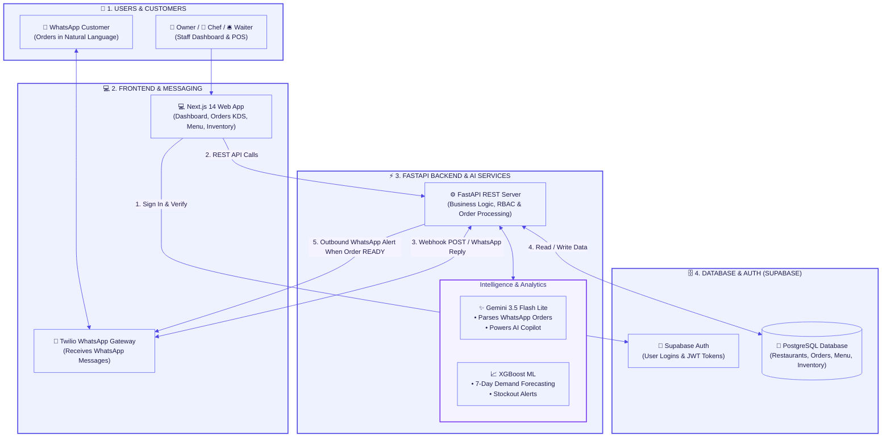
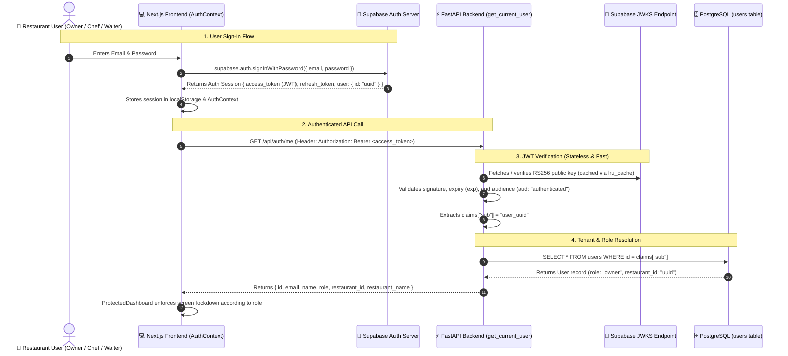
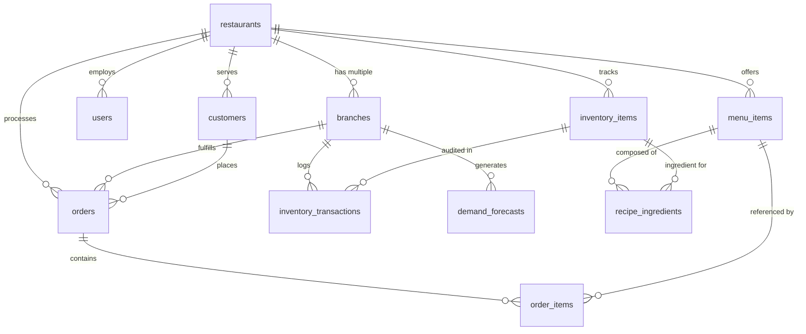
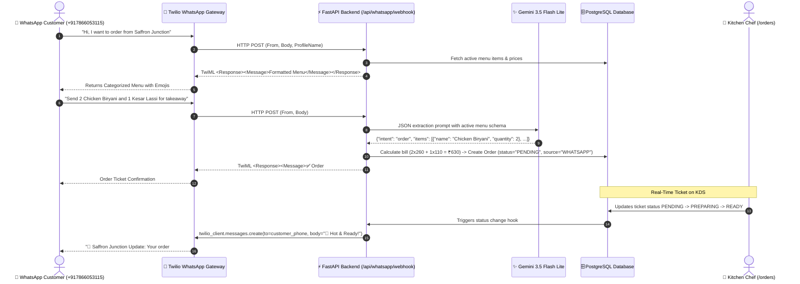

# 🍲 RasoiSaathi (रसोई साथी) — Complete Technical Architecture & System Documentation

> **Next-Generation Omnichannel Restaurant Operating System, AI Kitchen Copilot & WhatsApp Automated Ordering Engine**

---

## 📑 Table of Contents
1. [System Overview & Vision](#1-system-overview--vision)
2. [Full Tech Stack & Dependencies](#2-full-tech-stack--dependencies)
3. [Multi-Tenant Database Architecture & Schemas](#3-multi-tenant-database-architecture--schemas)
4. [Role-Based Access Control (RBAC) & Security Architecture](#4-role-based-access-control-rbac--security-architecture)
5. [AI WhatsApp Ordering Bot (Twilio + Gemini 3.5 Flash Lite)](#5-ai-whatsapp-ordering-bot-twilio--gemini-35-flash-lite)
6. [Kitchen Display System (KDS) & Order Lifecycle](#6-kitchen-display-system-kds--order-lifecycle)
7. [Automated Bill of Materials (BOM) & Inventory Auto-Depletion](#7-automated-bill-of-materials-bom--inventory-auto-depletion)
8. [XGBoost ML Demand Forecasting & Stockout Prediction](#8-xgboost-ml-demand-forecasting--stockout-prediction)
9. [RasoiSaathi AI Copilot (RAG + Function Calling)](#9-rasoisaathi-ai-copilot-rag--function-calling)
10. [Comprehensive REST API Reference](#10-comprehensive-rest-api-reference)
11. [Frontend Component Hierarchy & State Management](#11-frontend-component-hierarchy--state-management)
12. [Installation, Seeding & Deployment Guide](#12-installation-seeding--deployment-guide)

---

## 1. System Overview & Vision

**RasoiSaathi (रसोई साथी)** is a cloud-native, multi-tenant restaurant operating platform engineered specifically for Indian food establishments — ranging from single-location diners to multi-outlet cloud kitchen networks. 

### Core Problems Solved:
1. **Aggregator Commission Drag & Friction**: Enables direct WhatsApp-based conversational food ordering with zero aggregator commissions.
2. **Kitchen-Floor Disconnect**: Unifies incoming orders across POS, WhatsApp, Swiggy, and Zomato into a synchronized Kitchen Display System (KDS).
3. **Food Waste & Stockouts**: Real-time recipe-based ingredient consumption tracking coupled with an XGBoost machine learning model that forecasts ingredient demands 7 days in advance.
4. **Actionable Business Intelligence**: An AI Copilot that allows restaurant owners to query their operational data via natural language.

---

## 2. System Architecture & Flow

### 🌟 High-Level Architecture Overview (Simplified)



---

### 🔍 Detailed Tier-by-Tier Component Breakdown


---

### 🔐 Detailed Authentication & Identity Architecture

RasoiSaathi uses a **decoupled hybrid authentication pattern** combining **Supabase Auth** (for client credentials and session tokens) and **FastAPI internal RBAC** (for multi-tenant data isolation and role boundaries):



#### How Login Data & Roles Are Stored:
1. **Supabase Auth Identity (`auth.users`)**:
   * Stores hashed passwords, email verification status, and login timestamps.
   * Issues cryptographic JWTs signed with RSA private keys.
2. **Internal Multi-Tenant Profile (`public.users`)**:
   * Shares the exact same UUID primary key as `auth.users.id`.
   * Holds the multi-tenant ownership link: `restaurant_id` $\to$ `restaurants.id`.
   * Holds the operational role string: `owner`, `chef`, or `waiter`.
   * Holds account state: `is_active: bool`.
3. **Stateless Verification**:
   * The FastAPI backend never makes slow network calls to Supabase Auth on each request. Instead, it cryptographically validates the token's RS256 signature using Supabase's public JWKS certificates and queries the local PostgreSQL database for tenant scoping.

### Dependency Stack
* **Backend Framework**: `FastAPI 0.115+`, `Uvicorn 0.34+`, `Pydantic 2.10+`, `Pydantic-Settings`.
* **Database & ORM**: `SQLAlchemy 2.0+` (Mapped columns), `asyncpg` / `psycopg2-binary`, `Alembic`.
* **AI & Natural Language Processing**: `google-genai` (Gemini 3.5 Flash Lite with JSON mode & tool calling).
* **Machine Learning**: `xgboost 2.1+`, `scikit-learn 1.6+`, `pandas 2.2+`, `numpy 2.2+`.
* **Communication & Telephony**: `twilio 9.11+`, `python-multipart`.
* **Frontend**: `Next.js 14.2+`, `React 18.3+`, `Tailwind CSS 3.4+`, `Lucide React 0.475+`, `@supabase/supabase-js 2.49+`.

---

## 3. Multi-Tenant Database Architecture & Schemas

The database design is architected around strict multi-tenancy where every operational record references a root `restaurant_id` UUID.



### Table Schema Definitions

#### 1. `restaurants`
* `id` (`UUID`, PK) — Unique restaurant tenant ID.
* `name` (`VARCHAR(150)`) — Brand name (e.g., "Saffron Junction").
* `gstin` (`VARCHAR(15)`, Nullable) — Indian GST tax number.
* `currency` (`VARCHAR(10)`, Default `"INR"`) — ISO currency code.
* `settings` (`JSONB`, Default `{}`) — Configuration flags (tax rates, order defaults).
* `created_at`, `updated_at` (`TIMESTAMPTZ`).

#### 2. `branches`
* `id` (`UUID`, PK) — Physical branch / cloud kitchen ID.
* `restaurant_id` (`UUID`, FK `restaurants.id`) — Tenant link.
* `name` (`VARCHAR(120)`) — Branch name (e.g., "Central Kitchen - Bandra").
* `city` (`VARCHAR(80)`), `state` (`VARCHAR(80)`), `pincode` (`VARCHAR(10)`).
* `is_active` (`BOOLEAN`, Default `true`).

#### 3. `users`
* `id` (`UUID`, PK) — References Supabase Auth user UUID.
* `restaurant_id` (`UUID`, FK `restaurants.id`) — Tenant link.
* `email` (`VARCHAR(255)`, Unique) — Login email.
* `name` (`VARCHAR(120)`) — Full name.
* `role` (`VARCHAR(30)`) — Access role: `owner`, `chef`, or `waiter`.
* `is_active` (`BOOLEAN`, Default `true`).

#### 4. `menu_items` & `recipe_ingredients`
* **`menu_items`**: `id`, `restaurant_id`, `name`, `category` (`MAINS`, `STARTERS`, `BEVERAGES`, `DESSERTS`), `price` (`NUMERIC(10,2)`), `food_type` (`veg` / `non-veg`), `is_active`.
* **`recipe_ingredients`** (Bill of Materials):
  * `id` (`UUID`, PK).
  * `menu_item_id` (`UUID`, FK `menu_items.id`).
  * `inventory_item_id` (`UUID`, FK `inventory_items.id`).
  * `quantity_per_unit` (`NUMERIC(10,4)`) — Exact raw stock consumed per single dish prepared.

#### 5. `inventory_items` & `inventory_transactions`
* **`inventory_items`**: `id`, `restaurant_id`, `branch_id`, `name`, `unit` (`kg`, `ltr`, `pcs`, `grams`), `current_stock`, `min_threshold`, `cost_per_unit`.
* **`inventory_transactions`**: `id`, `inventory_item_id`, `branch_id`, `transaction_type` (`CONSUMPTION`, `PURCHASE`, `WASTAGE`, `ADJUSTMENT`), `quantity` (signed `NUMERIC`), `unit_cost`, `reference_id` (Order ID or PO number).

#### 6. `customers`
* `id` (`UUID`, PK).
* `restaurant_id` (`UUID`, FK `restaurants.id`).
* `phone` (`VARCHAR(20)`) — Customer phone number (Unique per restaurant).
* `name` (`VARCHAR(150)`), `preferred_language` (`VARCHAR(10)`).

#### 7. `orders` & `order_items`
* **`orders`**: `id`, `restaurant_id`, `branch_id`, `customer_id`, `order_source` (`POS`, `WHATSAPP`, `SWIGGY`, `ZOMATO`), `order_type` (`DINE_IN`, `DELIVERY`, `TAKEAWAY`), `status` (`PENDING`, `PREPARING`, `READY`, `COMPLETED`, `CANCELLED`), `total_amount`, `ordered_at`.
* **`order_items`**: `id`, `order_id`, `menu_item_id`, `quantity`, `unit_price`, `total_price`.

---

## 4. Role-Based Access Control (RBAC) & Security Architecture

### Permission Matrix & Screen Scoping

| Module / Route | 👑 Owner | 🍳 Chef | 🛎️ Waiter |
|---|:---:|:---:|:---:|
| **Executive Dashboard** (`/dashboard`) | ✅ Full Access | ❌ Blocked | ❌ Blocked |
| **Kitchen Display Queue** (`/orders`) | ✅ Full Access | ✅ Primary Screen | ❌ Blocked |
| **Waiter POS Terminal** (`/waiter-orders`) | ✅ Full Access | ❌ Blocked | ✅ Primary Screen |
| **Menu & Recipes** (`/menu`) | ✅ Full Access | ✅ Read/Edit | ❌ Blocked |
| **Inventory & Purchasing** (`/inventory`) | ✅ Full Access | ❌ Blocked | ❌ Blocked |
| **Sales & Channel Analytics** (`/analytics`) | ✅ Full Access | ❌ Blocked | ❌ Blocked |
| **RasoiSaathi AI Copilot** (`/copilot`) | ✅ Full Access | ❌ Blocked | ❌ Blocked |
| **Staff & Roles Management** (`/settings/staff`) | ✅ Full Access | ❌ Blocked | ❌ Blocked |
| **Restaurant & Outlets** (`/settings/outlets`) | ✅ Full Access | ❌ Blocked | ❌ Blocked |

### Implementation Details:
* **Backend Security**: FastAPI dependency injection `require_roles("owner")`, `require_roles("owner", "chef")` verifies claims extracted from validated Supabase JWTs.
* **Frontend Security**: [`ProtectedDashboard.js`](file:///c:/Users/SAMBODHI/Desktop/rasoi-sathi/frontend%20mockup/src/components/dashboard/ProtectedDashboard.js) inspects `applicationUser.role`. If a Waiter accesses any unauthorized route, they are automatically redirected to `/waiter-orders`; Chefs are auto-redirected to `/orders`.

---

## 5. AI WhatsApp Ordering Bot (Twilio + Gemini 3.5 Flash Lite)



### Key Components:
1. **Inbound Webhook (`POST /api/whatsapp/webhook`)**: Receives `application/x-www-form-urlencoded` payloads from Twilio, handles sender phone normalization, and returns instant TwiML XML.
2. **Conversational State Engine (`backend/app/services/whatsapp_bot.py`)**:
   * Tracks customer session and active restaurant selection in-memory.
   * Delivers formatted menus with visual food type pills (🟢 Veg, 🔴 Non-Veg) and prices.
3. **Gemini Extraction**: Converts unstructured Hindi/English text into validated `order_items` JSON referencing database `menu_item_id`s.
4. **Outbound Push Notifications**: When Chef changes order status to `"READY"`, `send_whatsapp_order_ready_notification()` dispatches a personalized ready alert to the customer.

---

## 6. Kitchen Display System (KDS) & Order Lifecycle

Located in [`frontend mockup/src/app/(dashboard)/orders/page.js`](file:///c:/Users/SAMBODHI/Desktop/rasoi-sathi/frontend%20mockup/src/app/%28dashboard%29/orders/page.js):

### Lifecycle States:
1. **`PENDING`** (Amber badge): Incoming order newly created via POS or WhatsApp.
2. **`PREPARING`** (Blue badge): Chef has accepted the order and started food preparation.
3. **`READY`** (Emerald badge): Food is cooked and packaged. Triggers the outbound WhatsApp notification to the customer.
4. **`COMPLETED`** (Slate badge): Order picked up or delivered. **Triggers automated recipe ingredient inventory deduction**.
5. **`CANCELLED`** (Rose badge): Order voided.

---

## 7. Automated Bill of Materials (BOM) & Inventory Auto-Depletion

When an order transitions to `COMPLETED` or `READY`, the backend automatically calculates raw ingredient consumption across all line items:

$$\text{Total Consumption}(i) = \sum_{j \in \text{Order Items}} \text{Quantity}_j \times \text{BOM Quantity}(i, j)$$

### Safety & Concurrency:
* Uses SQLAlchemy `with_for_update()` row-level locks on `inventory_items` to prevent race conditions during peak hours.
* Validates sufficient stock before decrementing.
* Inserts an audit log into `inventory_transactions` with `transaction_type="CONSUMPTION"` and `reference_id=order.id`.

---

## 8. XGBoost ML Demand Forecasting & Stockout Prediction

Located in `backend/app/ml/forecaster.py`:

### Machine Learning Pipeline:
1. **Feature Engineering**:
   * Day of week (0–6), month, day of month.
   * Rolling 7-day and 14-day dish sales moving averages.
   * Channel distribution weights (POS, WhatsApp, Swiggy, Zomato).
2. **Model Training**:
   * `XGBRegressor(n_estimators=100, learning_rate=0.08, max_depth=5)`.
   * Predicts daily sales velocity per menu item for a 7-day forward horizon.
3. **Ingredient Explosion**:
   * Maps predicted dish demand back to raw ingredient BOM quantities.
4. **Reorder Alert Formula**:
   $$\text{Runout Days} = \frac{\text{Current Stock}}{\text{Predicted Daily Burn Rate}}$$
   If $\text{Runout Days} \le 2.0$ or $\text{Current Stock} < \text{Min Threshold}$, a high-priority reorder alert is generated.

---

## 9. RasoiSaathi AI Copilot (RAG + Function Calling)

Located in [`backend/app/services/copilot.py`](file:///c:/Users/SAMBODHI/Desktop/rasoi-sathi/backend/app/services/copilot.py):

### Available Tools / Function Declarations:
* `get_daily_revenue(days: int)`: Queries PostgreSQL for aggregate revenue and order counts.
* `source_performance(days: int)`: Compares channel performance (POS vs WhatsApp vs Swiggy vs Zomato).
* `stock_status()`: Scans inventory for low stock and imminent stockouts.
* `top_selling_dishes(limit: int)`: Ranks dishes by total units sold and revenue contribution.

---

## 10. Comprehensive REST API Reference

### 🔐 Authentication & Onboarding
* `GET /api/auth/me`
  * **Headers**: `Authorization: Bearer <supabase_jwt>`
  * **Response**: `{ id, email, name, role, restaurant_id, restaurant_name }`
* `POST /api/auth/onboarding`
  * **Payload**: `{ name, email, restaurant_name, phone }`
  * **Action**: Creates `Restaurant`, initial `Branch`, and sets user `role="owner"`.

### 👥 Staff & Team Management
* `GET /api/staff` — List all staff members for the owner's restaurant (`require_roles("owner")`).
* `POST /api/staff` — Create staff user (`name`, `email`, `role`: `chef` | `waiter`).
* `PATCH /api/staff/{id}` — Toggle active status (`is_active: bool`) or change role.
* `DELETE /api/staff/{id}` — Remove staff member.

### 🍽️ Orders & Kitchen KDS
* `GET /api/orders?branch_id={uuid}&status={status}` — List orders with line items and customer data.
* `POST /api/orders` — Create new order (POS / Floor terminal).
* `PATCH /api/orders/{id}` — Update status (`PENDING` $\to$ `PREPARING` $\to$ `READY` $\to$ `COMPLETED`). Triggers WhatsApp notification on `READY`.

### 📦 Inventory & Menu
* `GET /api/menu` — List menu items with categories and prices.
* `GET /api/inventory` — List branch inventory items, current stock, and thresholds.
* `GET /api/forecasts/reorder-alerts` — Get XGBoost-predicted reorder suggestions.

### 💬 WhatsApp Webhook
* `POST /api/whatsapp/webhook` — Twilio inbound message endpoint.
* `POST /api/whatsapp/simulate` — In-dashboard testing simulation endpoint.

---

## 11. Frontend Component Hierarchy & State Management

```
frontend mockup/src/
├── app/
│   ├── (dashboard)/
│   │   ├── layout.js              # Topbar + Sidebar + ProtectedDashboard wrapper
│   │   ├── dashboard/page.js      # Executive Summary, KPIs & Recent Orders
│   │   ├── orders/page.js         # Kitchen Display System (KDS) Live Queue
│   │   ├── waiter-orders/page.js  # Floor Waiter POS Terminal
│   │   ├── menu/page.js           # Menu & Recipe Ingredients Management
│   │   ├── inventory/page.js      # Stock Levels, BOM & Reorder Alerts
│   │   ├── analytics/page.js      # Revenue Charts & Channel Performance
│   │   ├── copilot/page.js        # AI Copilot Conversational Assistant
│   │   └── settings/
│   │       ├── outlets/page.js    # Multi-Branch & Outlet Settings
│   │       └── staff/page.js      # Staff Directory & Role Provisioning
│   ├── login/page.js              # Supabase Auth Login with Role Auto-Redirect
│   └── signup/page.js             # Restaurant Onboarding Registration
├── components/
│   └── dashboard/
│       ├── ProtectedDashboard.js  # RBAC Route Guard & Redirection
│       ├── Sidebar.js             # Role-Filtered Navigation Sidebar
│       ├── Topbar.js              # User Avatar, Active Role Badge & Branch Selector
│       └── OutletSwitcher.js      # Multi-Outlet Dynamic Switcher
└── context/
    ├── AuthContext.js             # Supabase Session & Database User Claims
    └── OutletContext.js           # Active Branch Selection & State
```

---

## 12. Installation, Seeding & Deployment Guide

### 1. Backend Setup
```bash
cd backend
python -m venv venv
venv\Scripts\activate            # On Windows (or source venv/bin/activate on Linux/Mac)
pip install -r requirements.txt

# Run database migrations
alembic upgrade head

# Seed demo restaurant (Saffron Junction), menu, inventory, and users
python seed_demo.py

# Launch FastAPI development server
uvicorn app.main:app --reload --port 8000
```

### 2. Frontend Setup
```bash
cd "frontend mockup"
npm install
npm run dev
```

### 3. Connecting Live WhatsApp Webhook (Twilio Sandbox)
1. In your terminal, expose port 8000 via SSH:
   ```bash
   ssh -R 80:127.0.0.1:8000 nokey@localhost.run
   ```
2. Copy the generated `https://xxxx.lhr.life` URL.
3. In Twilio Console $\to$ **WhatsApp sandbox settings** $\to$ **"WHEN A MESSAGE COMES IN"**:
   * Method: `HTTP POST`
   * URL: `https://xxxx.lhr.life/api/whatsapp/webhook`
4. Click **Save** and start texting from your phone!
